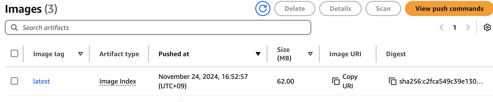
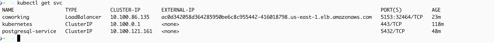
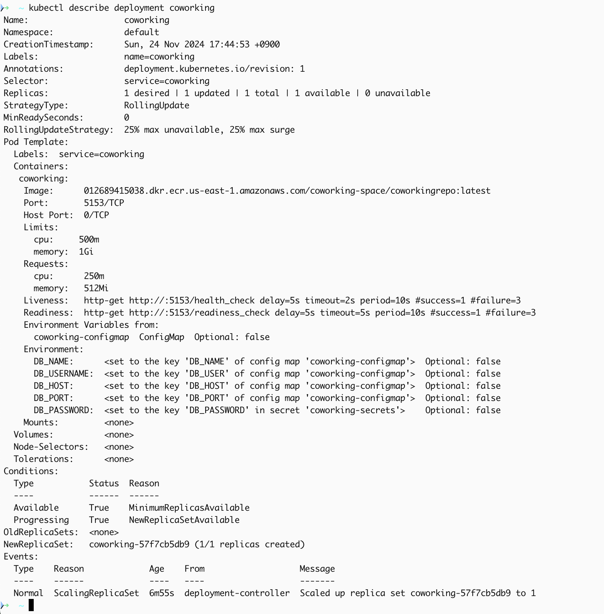
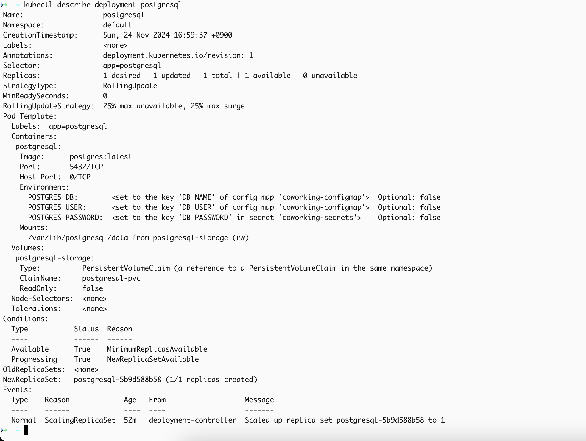
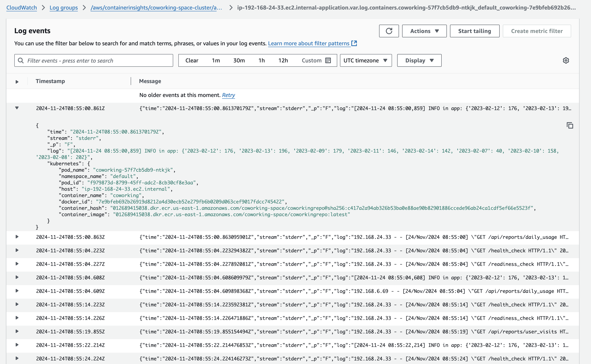

# Coworking Space Service Extension
The Coworking Space Service is a set of APIs that enables users to request one-time tokens and administrators to authorize access to a coworking space. This service follows a microservice pattern and the APIs are split into distinct services that can be deployed and managed independently of one another.

## Project structure

/coworkingspaceservice
    /analytics
        app.py
        config.py
        requirements.txt
    /db
        1_create_tables.sql
        2_seed_users.sql
        3_seed_tokens.sql
    /deployment
        configmap.yaml
        secrets.yaml
        pv.yaml
        pvc.yaml
        postgresql-deployment.yaml
        postgresql-service.yaml
        coworking.yaml
    /screenshots
    /scripts
    Dockerfile
    buildspec.yml
    README.md

## Getting Started

### 1.Working with AWS EKS - Kubernetes Environment with AWS EKS

For deployment will create EKS cluster at first, then update the context in the local Kubeconfig file to allows configuring access to clusters. You can change cluster name and region if needed.

1. Create an EKS Cluster:

```bash
./scripts/create_eks.sh coworking-service-cluster us-east-1
```

2. Update Kubeconfig to point to created EKS cluster:

```bash
aws eks update-kubeconfig --region us-east-1 --name coworking-service-cluster
```

### 2.Working with AWS ECR

Next, we need to create a repository in ECR to be able to store Application Image for docker build, by execute the following command. You also can change the repository name and region if needed.

1. Create AWS ECR

```bash
./scripts/create_ecr.sh coworking-space/coworkingrepo us-east-1
```

2. Create AWS CodeBuild to build Docker images remotely

- Create CodeBuild for the build pipeline, this build will uses config contents in `buildspecs.yml` from source code repository (Github).
Everytime `main` branch on Github has pushed, this build will be triggered.
This build also has some environment variable which will be used in `buildspecs.yml` such us, 

- Please refer to `Deliverables` section for the image.

### 3.Working with Applications

1. Configure variables and secrets

```bash
kubectl apply -f deployment/configmap.yaml
kubectl apply -f deployment/secrets.yaml
```

2. Deploy the Database

```bash
kubectl apply -f deployment/pv.yaml
kubectl apply -f deployment/pvc.yaml
kubectl apply -f deployment/postgresql-deployment.yaml
kubectl apply -f deployment/postgresql-service.yaml
```

3. Create seed data from local sql files

```bash
export DB_PASSWORD=`kubectl get secret coworking-secrets -o jsonpath='{.data.DB_PASSWORD}' | base64 --decode`
export DB_USER=`kubectl get configMap coworking-configmap -o jsonpath='{.data.DB_USER}'`
export DB_NAME=`kubectl get configMap coworking-configmap -o jsonpath='{.data.DB_NAME}'`

kubectl port-forward --namespace default svc/postgresql-service 5432:5432 &
    PGPASSWORD="$DB_PASSWORD" psql --host 127.0.0.1 -U ${DB_USER} -d ${DB_NAME} -p 5432 -f ./db/1_create_tables.sql
PGPASSWORD="$DB_PASSWORD" psql --host 127.0.0.1 -U ${DB_USER} -d ${DB_NAME} -p 5432 < ./db/2_seed_users.sql
PGPASSWORD="$DB_PASSWORD" psql --host 127.0.0.1 -U ${DB_USER} -d ${DB_NAME} -p 5432 < ./db/3_seed_tokens.sql
```

4. Deploy the Application

- Update Application Image URI in deployment/coworking.yaml then execute the following command to deploy the application


```bash
kubectl apply -f deployment/coworking-service.yaml
kubectl apply -f deployment/coworking.yaml
```

5. Verify deployment

- Execute the following command to verify the running Services

    ```bash
    kubectl get svc
    ```

    - Result:
    ```
    coworking
    postgresql-service
    ```

- Confirm services details: 

    - Database service details: 
    `kubectl describe svc postgresql`

    - Application service details: 
    `kubectl describe deployment coworking`
    
- Execute the following command to verify the running Pods

    ```bash
    kubectl get pods
    ```

- Access Load Balancer's pubic IP and confirm API's responses

[URL](http://ALBIP.com:5153)
[User Visits](http://ALBIP.com:5153/api/reports/user_visits)
[Daily Usage](http://ALBIP.com:5153/api/reports/daily_usage)

* Generate report for check-ins grouped by dates
`curl <BASE_URL>/api/reports/daily_usage`

* Generate report for check-ins grouped by users
`curl <BASE_URL>/api/reports/user_visits`


### 4.Working with AWS CloudWatch


1. Working with Logging

- To able to get loggging from compute nodes in the cluster, we need attach CloudWatchAgentServerPolicy to the EKS cluster role.

```bash
aws iam attach-role-policy \
--role-name eksctl-coworking-space-cluster-nod-NodeInstanceRole-UGcqqhDeUNVh \
--policy-arn arn:aws:iam::aws:policy/CloudWatchAgentServerPolicy
```

- Execute the following command to install the Amazon CloudWatch Observability Add-on for the EKS cluster, this will stream Kubernetes logs to CloudWatch Logs for monitoring

```bash
aws eks create-addon --addon-name amazon-cloudwatch-observability --cluster-name coworking-space-cluster
```

##  Deliverables
1. `Dockerfile`
    `./Dockerfile`
2. Screenshot of AWS CodeBuild pipeline
    
3. Screenshot of AWS ECR repository for the application's repository
    
4. Screenshot of `kubectl get svc`
    
5. Screenshot of `kubectl get pods`
    
6. Screenshot of `kubectl describe svc <DATABASE_SERVICE_NAME>`
    
7. Screenshot of `kubectl describe deployment <SERVICE_NAME>`
    
    
8. All Kubernetes config files used for deployment (ie YAML files)
    `./deployment/*`
9. Screenshot of AWS CloudWatch logs for the application

10. `README.md`


### Stand Out Suggestions
Please provide up to 3 sentences for each suggestion. Additional content in your submission from the standout suggestions do _not_ impact the length of your total submission.
1. Specify reasonable Memory and CPU allocation in the Kubernetes deployment configuration
- Least half a CPU core for CPU Requests (500m) to run application consistently, CPU Limits (1000m) to avoid insufficient resource of other.
- Grant Memory enough memory without overcommitting for Requests (800Mi), Memory Limits (2Gi) to prevents the pod from exceeding memory.
resources:
  requests:
    cpu: "500m"     
    memory: "800Mi" 
  limits:
    cpu: "1000m"     
    memory: "2Gi"   
```

2. AWS instance type would be best used for the application
- For AWS instance type, Memory and CPU allocation considerations, it's depends on workloads and active users of this application, cost efficiency also a important factor to consider. We are using Load Balancer and Auto Scaling group to scale horizontally if user activity varies sigfinicantly. So a `t3.medium` may be a good starting point for light workloads.

```

3. How we can save on costs?
- Using Spot Instances with right size t3.medium could reduce usage cost.
- Using small docker base image size to lower resource startup time and consumption.
- Set up alerts for unexpected spikes in usage on monitoring.
